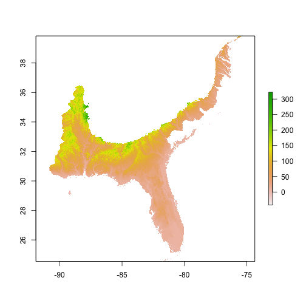
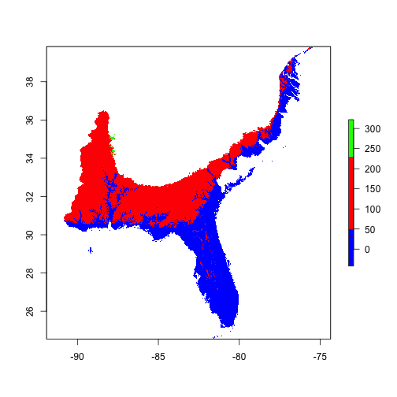
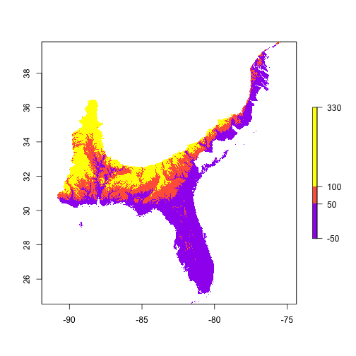
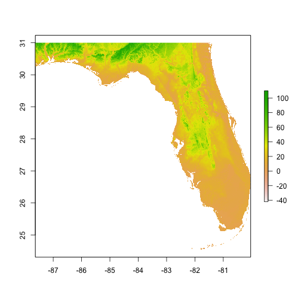
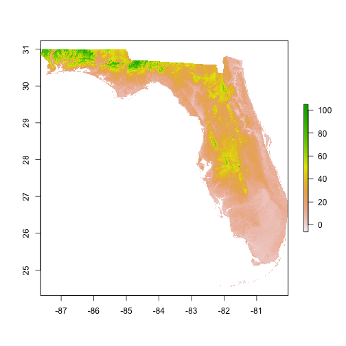

Raster Package
========================================================
author: Charlotte
date: April 17th, 2015

Working with raster files
========================================================
The Raster package allows you to import, manipulate and project maps and their data. There are TONS of functions in raster!!! 

- Importing a raster file
- plotting the map
- cell statistics
- Cropping the map to the desired area
- raster to points, distance from points
- stacking
- layers statistics
- extracting values
- exporting

Importing a map 
========================================================


```r
library(raster)
##alt <- raster(url("https://raw.githubusercontent.com/charlottegermain/RasterPkgDemo/master/data/alt.asc"))

alt <- raster("data/alt.asc")
alt
```

```
class       : RasterLayer 
dimensions  : 1836, 1848, 3392928  (nrow, ncol, ncell)
resolution  : 0.008333333, 0.008333333  (x, y)
extent      : -90.83333, -75.43333, 24.54167, 39.84167  (xmin, xmax, ymin, ymax)
coord. ref. : NA 
data source : /Users/cgermain/Documents/GitHubRepos/RasterPkgDemo/data/alt.asc 
names       : layer 
```

```r
LATLON<-CRS("+proj=longlat +ellps=WGS84 +datum=WGS84 +no_defs +towgs84=0,0,0")
projection(alt) <- LATLON
alt
```

```
class       : RasterLayer 
dimensions  : 1836, 1848, 3392928  (nrow, ncol, ncell)
resolution  : 0.008333333, 0.008333333  (x, y)
extent      : -90.83333, -75.43333, 24.54167, 39.84167  (xmin, xmax, ymin, ymax)
coord. ref. : +proj=longlat +ellps=WGS84 +datum=WGS84 +no_defs +towgs84=0,0,0 
data source : /Users/cgermain/Documents/GitHubRepos/RasterPkgDemo/data/alt.asc 
names       : layer 
```

stats and plots
========================================================


```r
plot(alt)
```

 

```r
plot(alt, col=c("blue", "red", "green"))
```

 

```r
min <- cellStats(alt, min)
min
```

```
[1] -42
```

```r
max <- cellStats(alt, max)
max
```

```
[1] 327
```

```r
breakpoints <- c(-50, 50, 100, 330)
colors <- c("purple", "tomato", "yellow")
plot(alt, breaks=breakpoints, col=colors)
```

 


Cropping a map 
========================================================


```r
library(maptools)
Florida <- readShapePoly("data/FLstate2.shp")
projection(Florida)<- LATLON
Map <- crop(alt, Florida)
plot(Map)
```

 

```r
Map1 <- mask (Map, Florida)
plot(Map1)
```

 

```r
writeRaster(Map1, "Map1.asc", format="ascii")
```


Stacking Maps
========================================================


```
Error in .rasterFromASCIIFile(x, ...) : 
  Documents/GitHubRepos/RasterPkgDemo/data/bio2.asc  does not exist
```
